# Hi, welcome to my portfolio 👋 

Apple platforms engineer and tech enthusiast

# Technologies

```
● Mobile: iOS, Flutter(Beginner), React native(Beginner)
● Language: Swift, Objective C
● Architecture: MVC, MVVM, MVVMC, Clean
● UIKit, SwiftUI and Extensions
● API Integration: REST, GraphQL, ProtoBuf
● Database: Core data, Realm, SQL
● Testing: Unit testing, UI Testing
● Tools: Jira, Confluence, Git, Trello, Asana
● Real time services: XMPP, Pusher, Socket.io, Websockets
● Designs: Figma, Sketch, Zeplin, AdobeXD, Overflow, Canva
● Analytics: Firebase, Segment, AppsFlyer, MixPanel, Crashlytics, Sentry
● Payment: In App purchase, Stripe and Others
● CI: Fastlane using CircleCI, Github actions, Azure pipelines
● Distribution: Testflight, Diawi, Appcenter, Firebase distribution
● Dependency Manager: Cocoapods, Carthage and SPM, Manual
● Security: SSL Certificate pinning, CryptoSwift
● Mocking: WireMock, Charles
```

# Interests

* Basketball
* Software engineering
* Blogs

# Apps


### Baxta pets [🔗](https://apps.apple.com/app/apple-store/id1462624482?mt=8)

Domain: Social media, Networking, Chat

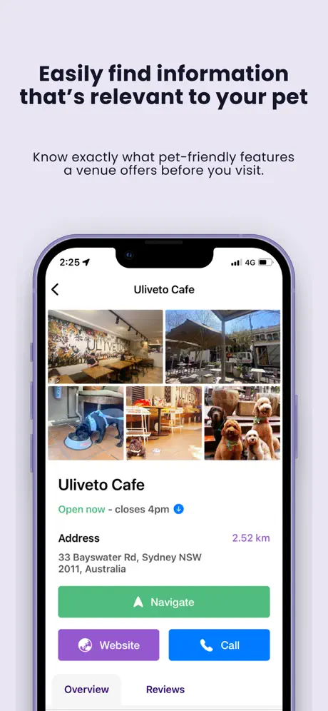 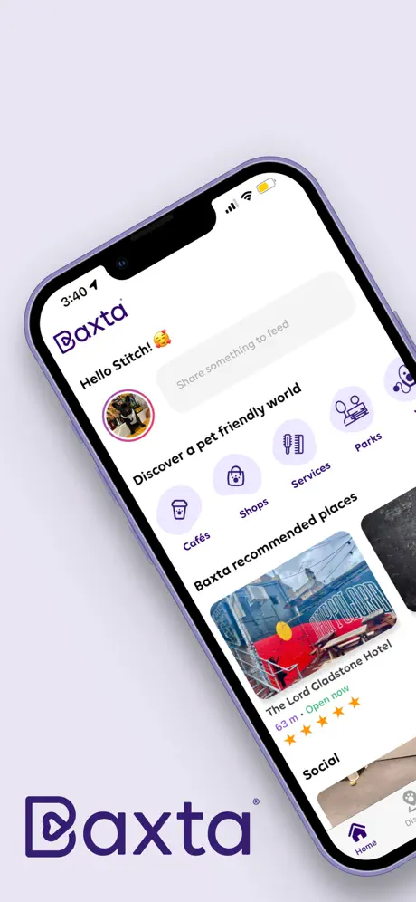  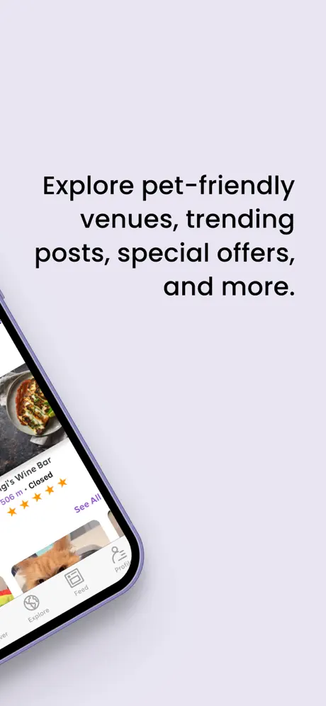


### Gochat [🔗](https://apps.apple.com/au/app/gochat/id1476243358)

Domain: Social media, Networking, Chat

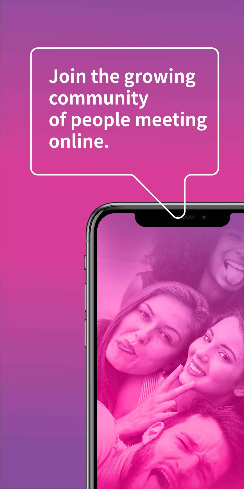 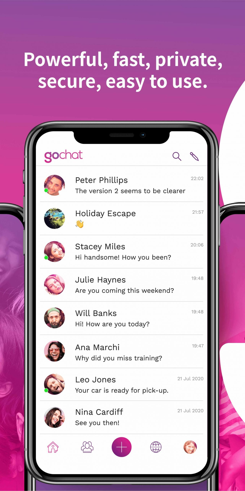 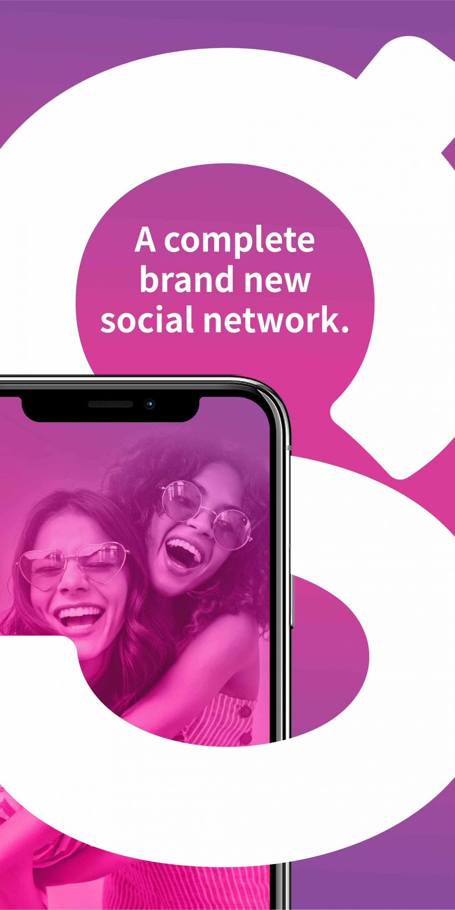 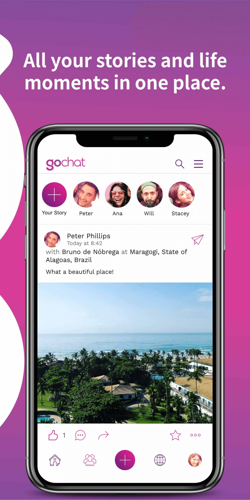 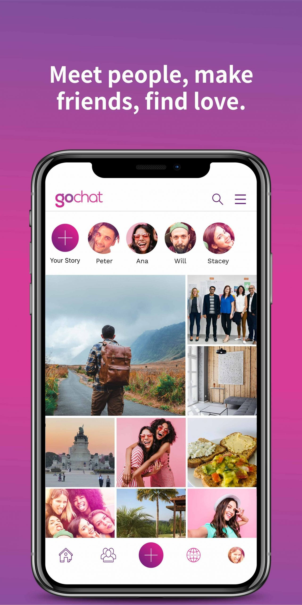 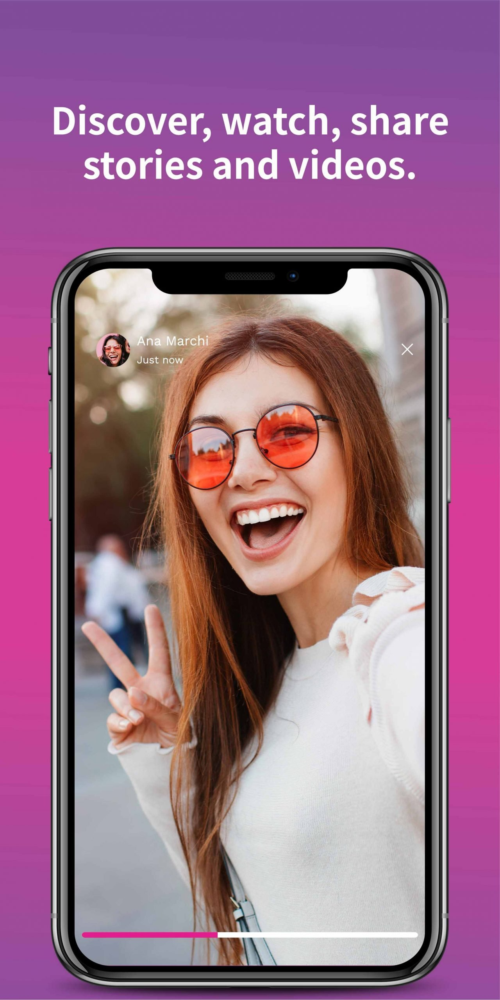


### TammyFit [🔗](https://apps.apple.com/au/app/tammy-fit/id1333303155)

Domain: Health and Fitness

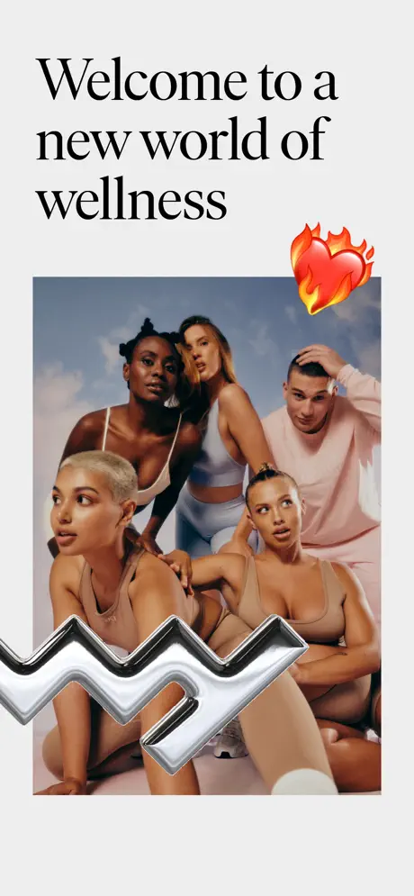 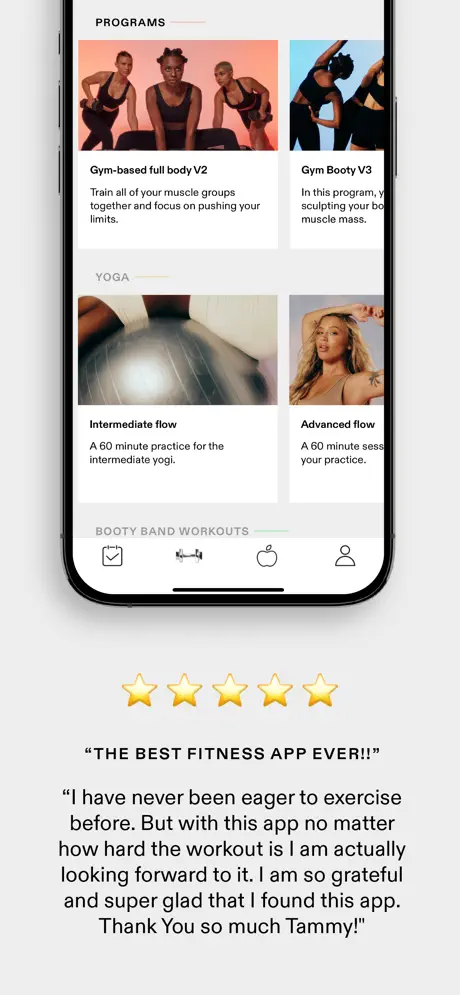 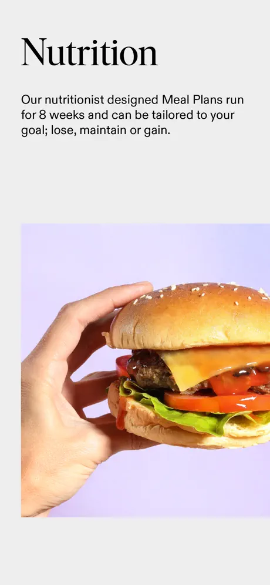 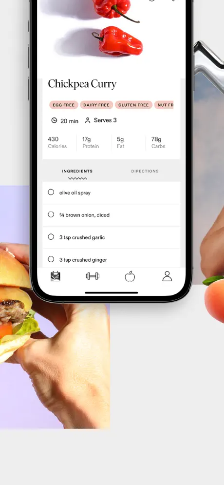


### UKO [🔗](https://apps.apple.com/us/app/uko/id1549060958)

Domain: Co-living spaces, Hospitality

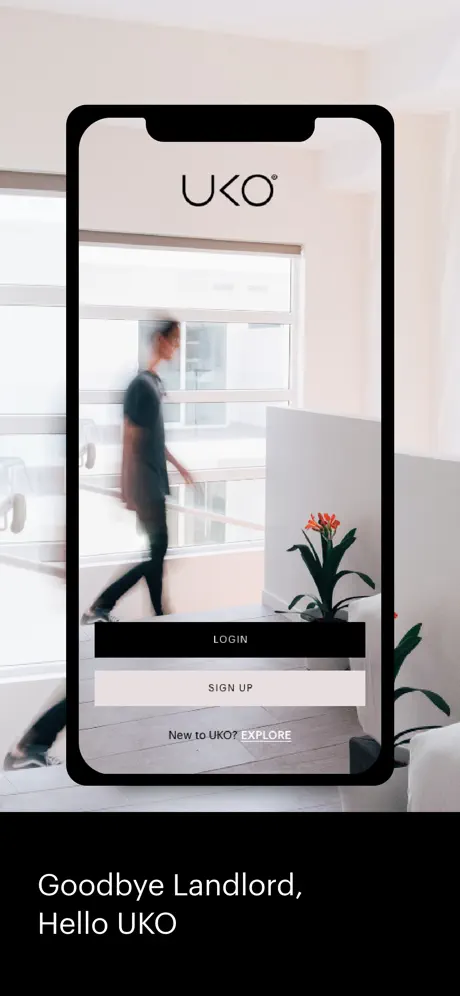 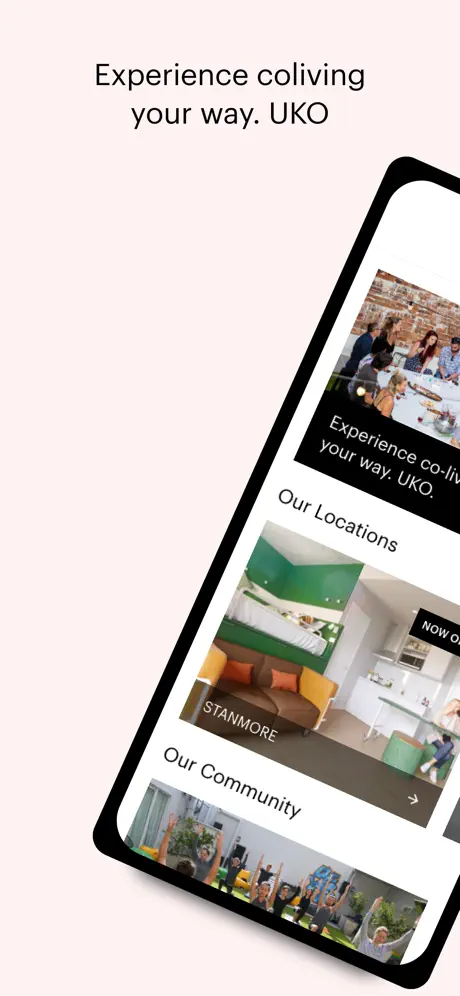 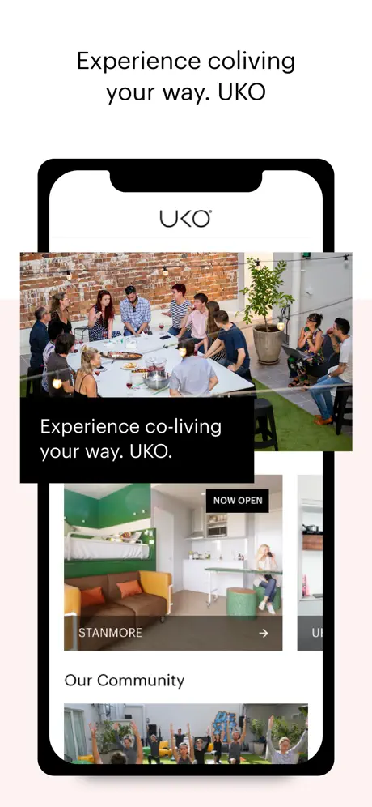 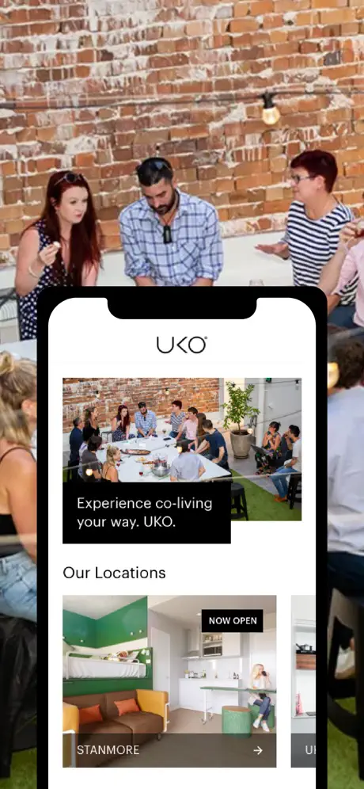


### The Yayos [🔗](https://apps.apple.com/us/app/id1436153967)

Domain: Vehicle booking

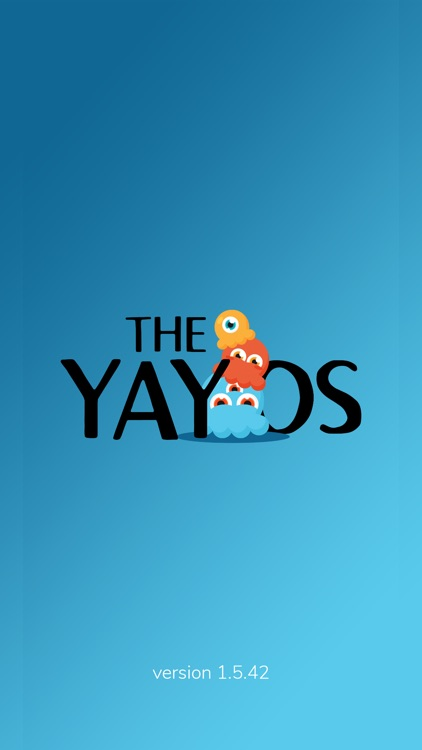 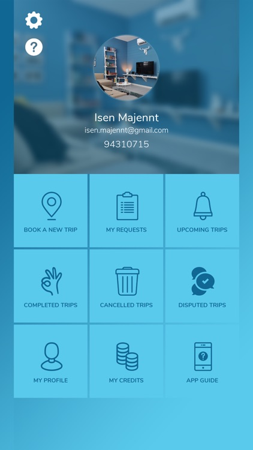 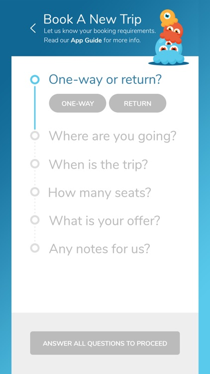 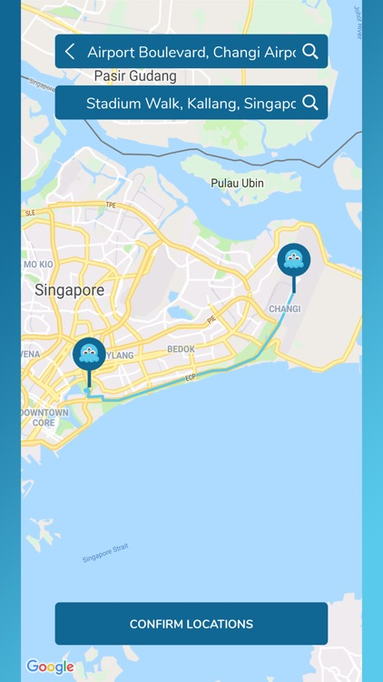 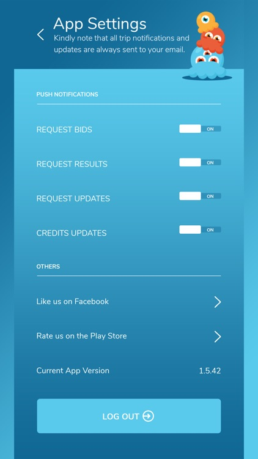 


## Get in touch

#### Email 📧  - nitanta.adh007@gmail.com
#### LinkedIn Profile [🔗](https://www.linkedin.com/in/nitanta-adhikari/)
#### Github [🔗](https://github.com/nitanta)
#### Skype [🔗](live:nitanta.adh007)